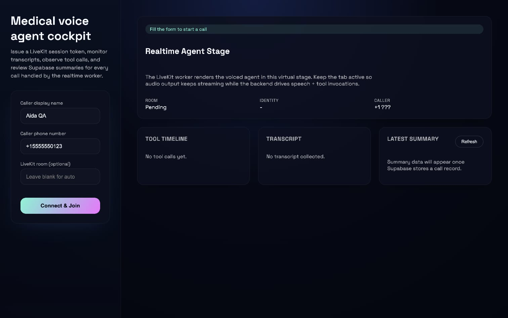

# AI Voice Agent

LiveKit-powered medical scheduling demo that pairs a Python backend agent worker with a React/Vite
frontend dashboard. The backend handles realtime media, tool execution, and persistence; the
frontend lets operators monitor the conversation (transcripts, tool calls, summaries) in the
browser.

```
voice-agent-backend  ─▶  Issues LiveKit tokens, runs LiveKit Agent worker,
                         bridges Deepgram STT, Cartesia TTS, OpenAI/Anthropic LLMs,
                         and exposes REST APIs for the UI.

voice-agent-frontend ─▶  React + Zustand client that calls the backend API, joins the
                         LiveKit room, streams DataChannel events, and surfaces call context.
```

## Repository Layout

| Path | Description |
| --- | --- |
| `voice-agent-backend/` | FastAPI entrypoint (`api.py`), LiveKit Agent worker (`agent.py`), service clients, tools, Dockerfile, and requirements. |
| `voice-agent-frontend/` | React + Vite app with session form, LiveKit connection logic, transcript/timeline/summary panels, and Tailwind-free styling. |
| `.venv/` | Optional top-level virtualenv (not committed) for ad-hoc scripting. Each sub-project manages its own environment. |

Each subdirectory ships with its own README that dives into implementation details, environment
variables, schema expectations, and testing tips.

## Tech Stack

- **Media & realtime:** LiveKit Cloud (Agents API, DataChannel bridge).
- **Backend:** Python 3.11, FastAPI, Uvicorn, LiveKit Agents SDK, Deepgram SDK, Cartesia SDK, OpenAI/Anthropic clients, Supabase/PostgREST helpers.
- **Frontend:** React 18, TypeScript, Vite 5, Zustand store, plain CSS modules.
- **Tooling:** `pip` + virtualenv, `npm` + Vite scripts, Dockerfile for backend container builds.

## Prerequisites

| Requirement | Notes |
| --- | --- |
| Python 3.11.x | Backend SDKs pin to 3.11; avoid 3.12+ until protobuf + LiveKit wheels catch up. |
| Node.js 18+ / npm 9+ | Required for Vite dev server and build chain. |
| LiveKit, Deepgram, Cartesia, OpenAI (and optional Anthropic/OpenRouter/Supabase) accounts | Free tiers exist for evaluation, but production keys belong in secret managers. |
| Homebrew / uv (optional) | Convenient for installing Python versions on macOS. |

## Environment Variables

Both apps ship with `.env.example` files. Common steps:

```bash
# Backend
cd voice-agent-backend
cp .env.example .env
# populate LIVEKIT_*, DEEPGRAM_*, CARTESIA_*, OPENAI_*, etc.

# Frontend
cd voice-agent-frontend
cp .env.example .env
# at minimum set VITE_API_BASE_URL (e.g., http://localhost:8000)
```

The backend refuses to start without `LIVEKIT_URL`, `LIVEKIT_API_KEY`, and `LIVEKIT_API_SECRET`.
Other keys gate optional integrations (STT, TTS, LLMs, Supabase persistence). Use sandbox credentials
while developing locally; rotate secrets before publishing the repo.

## Quick Start

1. **Backend**
   ```bash
   cd voice-agent-backend
   python3.11 -m venv .venv && source .venv/bin/activate
   pip install -r requirements.txt
   uvicorn api:app --reload --port 8000
   # in another terminal (optional) run the agent worker
   python agent.py dev
   ```

2. **Frontend**
   ```bash
   cd voice-agent-frontend
   npm install
   npm run dev -- --host
   ```

3. Visit `http://localhost:4173`, request a session token (defaults to hitting
   `http://localhost:8000/api/session`), and join the LiveKit room. Keep both terminals running.

## Testing & Verification

- **Backend:**
  - `uvicorn api:app --reload` and hit `/api/health`.
  - `python agent.py console` to ensure the worker can connect to LiveKit.
  - Exercise tools via REST (`/api/session`, `/api/appointments`, `/api/summaries`).
- **Frontend:**
  - `npm run build && npm run preview` to catch TypeScript issues.
  - Manual smoke test: connect, speak, verify transcript + timeline updates, ensure summaries refresh.

## Deployment Notes

- Backend Dockerfile located in `voice-agent-backend/` supports multi-stage builds; supply `.env` via
  secrets manager or orchestrator env injection.
- Frontend `npm run build` emits `voice-agent-frontend/dist/`, deployable to any static host (S3,
  Netlify, Vercel). Configure `BACKEND_CORS_ORIGINS` to include the public frontend URL.
- Scale LiveKit workers horizontally by running multiple instances of `agent.py start`. REST API can
  be scaled separately behind a load balancer.

## Contributing / Making It Public

Before pushing to a public GitHub repo:

- Remove `.env` files or replace secrets with placeholders (`.env` should stay gitignored).
- Document any deviations you make in the sub READMEs to keep future collaborators aligned.
- Open issues/PRs that describe changes to the LiveKit tool layer, Supabase schema, or frontend UX so
  reviewers can validate end-to-end flows.

For deeper implementation details, consult:

- [voice-agent-backend/README.md](voice-agent-backend/README.md)
- [voice-agent-frontend/README.md](voice-agent-frontend/README.md)

## UI Preview
